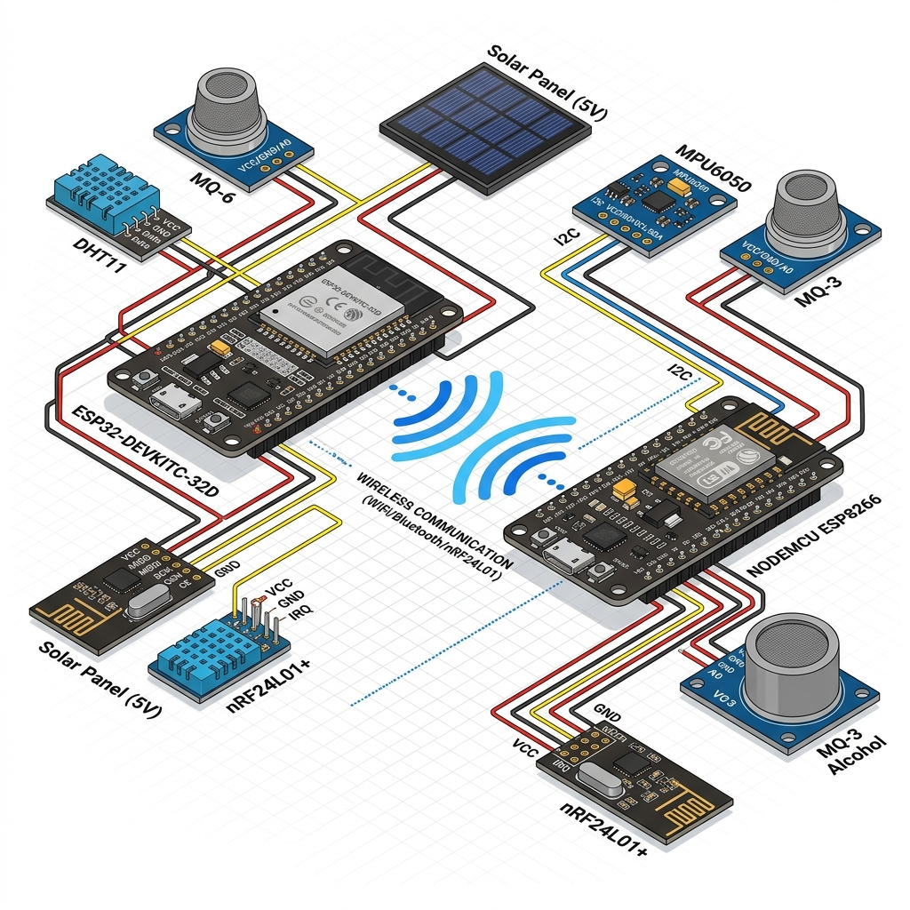

# 🚜 FarmTrace - Cold-Chain Tracking & Logistics Platform

FarmTrace is a comprehensive, end-to-end IoT platform designed to track the logistics, environmental conditions, and safety of cold-chain agricultural shipments.

It integrates real-world physical hardware (microcontrollers and sensors) with a mobile gateway app, a Node.js backend, and a real-time React web dashboard.

---

## 📡 Architecture Overview

The system architecture is designed for **Offline-First** environments where internet connectivity is frequently lost during transit.

1. **Container Node (ESP32)**: Physically attached to the refrigerated cargo. It reads environmental sensors and transmits the data via nRF24 radio to the driver. If the driver is out of range, the ESP32 logs data to a local MicroSD card.
2. **Driver Gateway (NodeMCU ESP8266)**: Located in the truck's cabin. It receives radio packets from the container, reads driver-side sensors (motion, alcohol), and hosts a Local Wi-Fi network for the driver's phone.
3. **Driver Mobile App (React Native)**: Connects to the NodeMCU's Local Wi-Fi, pulling all hardware data into a local SQLite database. When the phone regains 4G/5G internet, it pushes the data to the cloud.
4. **Backend (Node.js / Express)**: A RESTful API connected to MongoDB Atlas that handles data ingestion, command queuing, authentication, and driver logbooks.
5. **Web Dashboard (React)**: A comprehensive command center allowing operators to view real-time maps, live hardware telemetry, and issue remote commands back down the chain to the ESP32.

---

## 🛠️ Hardware Integration (Phase 3)



### Container Node Sensors (ESP32)
* **DHT11**: Temperature & Humidity monitoring.
* **MQ-6**: Analog gas sensor (for monitoring atmospheric changes/spoilage).
* **Battery ADC**: Monitors the remaining charge of the ESP32's Li-ion battery.
* **Solar ADC**: Monitors the voltage output of the solar panel charging system.
* **SD Card**: Failsafe offline storage queue.
* **nRF24L01**: 2.4GHz RF module for two-way communication.
* **Security**: Data integrity is guaranteed via `mbedtls` SHA-256 hash chaining on the ESP32.

### Driver Gateway Sensors (NodeMCU)
* **MPU6050**: I2C accelerometer/gyroscope measuring cabin vibration and driver motion.
* **MQ-3**: Analog alcohol sensor for driver safety monitoring.
* **nRF24L01**: Receives container data and blasts commands back.

> **Note on Wiring:** For exact GPIO mappings, board configuration, and wiring diagrams, please refer to [hardware_wiring.txt](./hardware_wiring.txt).

---

## 🚀 Getting Started

### 1. Database Configuration
The backend connects to MongoDB Atlas. Ensure the following environment variables are set in `backend/.env`:
```env
PORT=5000
MONGODB_URI=mongodb+srv://<username>:<password>@cluster0...
JWT_SECRET=your_jwt_secret
```

### 2. Running the Backend
```bash
cd backend
npm install
npm start
```
*The API will be available at `http://localhost:5000`*

### 3. Running the Web Dashboard
```bash
cd web
npm install
npm run dev
```
*The dashboard will be available at `http://localhost:5173`*

### 4. Running the Mobile App (React Native)
Ensure you have Android Studio and an emulator setup, or connect a physical device via USB.
```bash
cd mobile
npm install
npm run android
```
*(Note: If compiling the Android APK, ensure you have JDK 17 installed, as React Native does not currently support Java 25).*

---

## 💻 Flashing the Firmware

The microcontroller code is located in the `/firmware` directory.

1. Install the **Arduino IDE**.
2. **NodeMCU Gateway**: Open `firmware/driver_gateway/driver_gateway.ino`. Select the "NodeMCU 1.0 (ESP-12E Module)" board. Ensure you change the `AP_SSID` and `AP_PASS` in `config.h` if you wish to change the Wi-Fi credentials it broadcasts. Flash the firmware.
3. **ESP32 Container**: Open `firmware/container_node/container_node.ino`. Select the "ESP32 Dev Module" board. Flash the firmware.
4. **Mobile Config**: If you change the NodeMCU Wi-Fi settings or IP address, make sure you update the `LOCAL_WIFI_BASE` constant in `mobile/src/services/api.js`.

---

## 🔁 Two-Way Remote Commands
FarmTrace allows operators on the Web Dashboard to queue commands (like `REQUEST_BATTERY` or `SYNC_DATA`). 
1. The command is saved to MongoDB.
2. The Driver's Phone pulls the pending command over 4G/5G.
3. The Phone pushes the command to the NodeMCU over Local Wi-Fi.
4. The NodeMCU blasts the command to the ESP32 via nRF24 radio.
5. The ESP32 processes it and sends the response back up the chain!

*Developed during Phase 1-3 of the FarmTrace deployment.*
